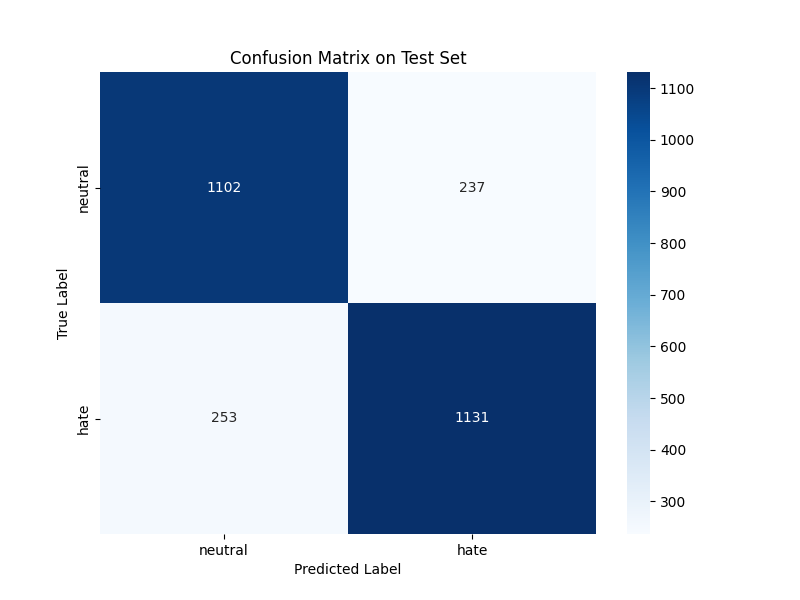

# RoBERTa Indonesian Hate Tweet Classification
Fine-tuned RoBERTa model for Indonesian hate speech detection in tweets.

## 📋 Overview

This project fine-tunes a RoBERTa model from [cardiffnlp/twitter-roberta-base-sentiment-latest](https://huggingface.co/cardiffnlp/twitter-roberta-base-sentiment-latest) to classify Indonesian tweets as either **neutral** or **hate speech**.

## 📊 Dataset

The dataset is a combination of:
- Twitter scraped data
- Existing datasets from various GitHub repositories
- All data has been cleaned and preprocessed

**Dataset available at:** [haipradana/indonesian-twitter-hate-speech-cleaned](https://huggingface.co/haipradana/indonesian-twitter-hate-speech-cleaned)

## 🎯 Performance Metrics

```
Accuracy:  82.01%
Precision: 82.68%
Recall:    81.72%
F1-Score:  82.19%
```

## 📈 Confusion Matrix

<p align="center">
    
</p>

## 🚀 Usage

### Quick Start

```python
from transformers import AutoTokenizer, AutoModelForSequenceClassification
import torch

# Load model
tokenizer = AutoTokenizer.from_pretrained('./model')
model = AutoModelForSequenceClassification.from_pretrained('./model')

# Predict
def predict(text):
    inputs = tokenizer(text, return_tensors="pt", truncation=True, padding=True, max_length=511)
    with torch.no_grad():
        outputs = model(**inputs)
    prediction = torch.argmax(outputs.logits, dim=1).item()
    return 'hate' if prediction == 1 else 'neutral'

# Example
result = predict("Paru-parumu terbuat dari batu ya? Sudah sakit gini masih aja merokok!")
print(result)  # Output: hate
```

### Using the Script

```bash
cd scripts
python predict.py
```

## 📁 Project Structure

```
roberta-indonesian-hate-tweet/
├── notebooks/               # Training notebooks
│   └── main_train_roberta.ipynb
├── scripts/                # Prediction scripts
│   └── predict.py
└── README.md
```

## 🛠️ Installation

```bash
pip install transformers torch datasets
```

## 📝 Labels

- `0`: **neutral** - Non-hate speech content
- `1`: **hate** - Hate speech content

## 🤝 Contributing

Contributions are welcome! Please feel free to submit a Pull Request.

## ⭐ Support

If you find this project helpful, please leave a ⭐ star!
